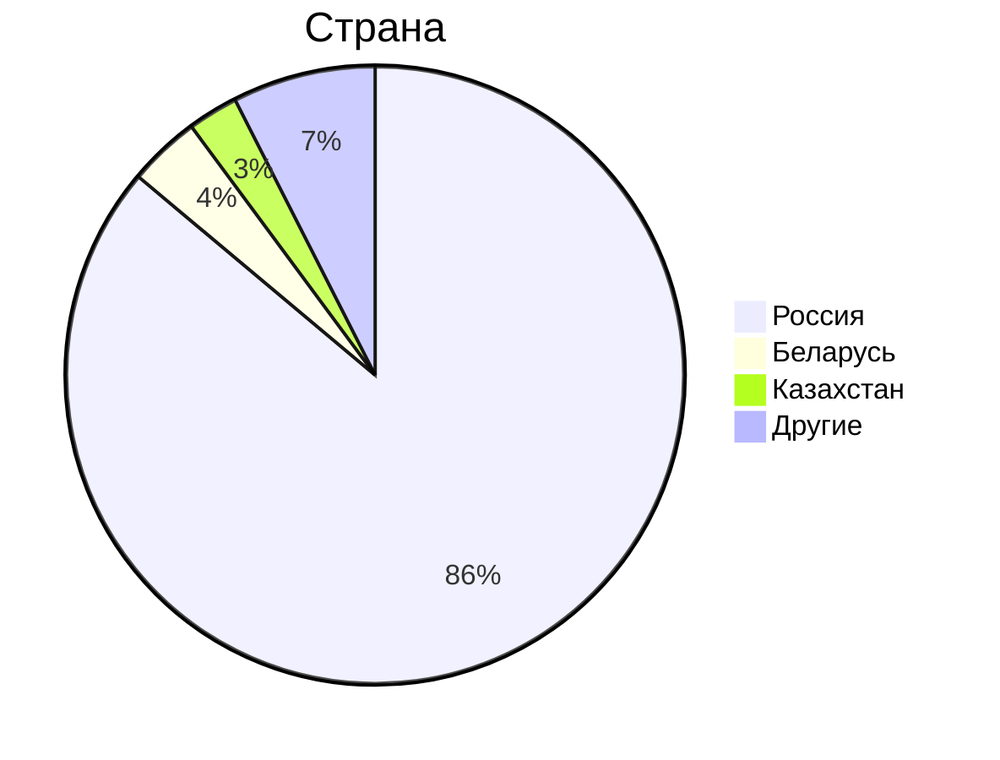

# 1. Тема, MVP, анализ аудитории.
**Облако Mail.ru** - облачный сервис для хранения и обмена файлами.

### MVP
1. Загрузка файлов на облако;
2. Скачивание файлов с облака;
3. Возможность создания директорий для распределения по ним файлов;
4. Возможность предоставить доступ к хранилищу или к папке другому человеку;

### Анализ трафика
- MAU - 23 млн.[^1]
- DAU - 2.5 млн.[^1]. Примем во внимание, что речь в заявлении идет о пользователях ресурса без учета пользователей мобильного приложения.
- За год пользователи загружают 30 млрд. файлов[^2]
- Общий объем хранилища составляет 600 петабайт[^2]

### Анализ аудитории
По данным сайта Similarweb[^3] аудитория распределяется следующим образом:

Таким образом, можно сказать, что вся ключевая аудитория располагается на территории СНГ.

## Отличия от конкурентов
От конкурентов в лице Google Drive, Dropbox и других облачных хранилищ, "облако" отличает интеграция с почтовыми сервисами. 

# 2. Расчет нагрузки
## Продуктовые метрики
- **Средний размер хранилища мользователя** - так как компания не разглашает информацию о среднем хранилище пользователя, я провел опрос с участием 100 человек и установил, что средний размер облачного хранилища пользователя составляет 37 Гб.
- **Среднее количество действий пользователя** - т.к. за год пользователи загружают 29.3 млрд. файлов[^5], то это в среднем 80 млн. файлов в день. Исходя из дневной аудитории в 2.5 млн. пользователей можно предположить, что в день средний пользователь загружает 32 файла. Предположим, что пользователи скачивают в день столько же файлов, сколько и загружают.
- **DAU** - 2.5 млн. Как уже было сказано ранее, это пользователи ресурса без учета мобильного приложения. Основываясь на том, что основная доля пользователей Облака Mail.ru из России и того, что доля мобильного трафика в России составляет 45,3%[^6], то примем DAU равным 4.6 млн, полагая, что все пользователи мобильных устройств используют мобильное приложения.

Нам также понадобится хранить различные метаданные пользователей и файлов: имя пользователя, ID пользователя, имя файла, путь к нему в файловом хранилище, является ли файл директорией и т.д. Рассмотрим примерную схему БД метаданных:

Посчитаем теперь сколько метаинформации придется дополнительно хранить, ограничив длину текста 30 символами:
Тип данных | Размер
------ | ------
Bigint | 8 байт
Text | 31 байт
Boolean | 1 байт
Timestamp | 8 байт

Тогда для каждого пользователя мы дополнительно храним 47 байт. Для каждого файла мы дополнительно храним 119 байт.
Найти информацию о среднем весе одного файла не удалось, поэтому, основываясь на том, что в основном пользователи хранят на облаке изображения со средним весом 1.75 Мб, чуть реже PDF со средним весом 1.5 Мб и еще реже mp4 со средним весом 300 Мб[^5] проведем расчеты. Пусть 50% файлов, хранимых пользователями - фото, 30% - документы, 15% - видео, и 5% - прочие файлы весом 0-20 МБ. Тогда средний размер одного фалйа 0.5 * 1.75 Мб + 0.3 * 1.5 Мб + 0.15 * 300Мб + 0.05 * 10Мб = 47 Мб

Итого:
Параметр | Значение
------ | ------
Месячная аудитория | 23 млн. человек
Дневная аудитория | 4.6 млн. человек
Средний размер хранилища пользователя | 37 Гб
Средний размер одного файла | 47 Мб
Загрузка файлов | 32 файла/день
Скачивание файлов | 32 запросов/день
Метаданные пользователя | 47 байт
Метаданные файла | 119 байт

## Технические метрики
### Размер хранения в разбивке по типам данных
Число пользователей в месяц 23 млн. => размер хранения данных = 23 млн. * 8 Гб = 184 Пб.

### Сетевой трафик
Посчитаем сетевой трафик при загрузке файла на облако и скачивании файла с облака.
- **Загрузка файлов на облако** - 32 запроса/день * 20 Мб = 640 Мб/день;
- **Скачивание файлов с облака** - 640 Мб/день;

Тогда средний суточный трафик загрузки и скачивания будет равен: 4.6 млн. * (32 запроса/день / 86400) * 47 Мб * 8 / 1024 = 626 Гбит/с. Пиковый показатель будет равен 288 Гбит/с. Всего за сутки трафик будет составлять: 4.6 млн * 32 запроса/день * 47 Мб / 1024 = 6756250 Гб/сутки.

Для дальнейших расчетов примем, что в пиковые часы мы будем ограничивать трафик, так как скорость передачи информации не играет существенной роли в контексте облачных сервисов. 
Так как каналы дуплексные, то итоговые значения не нужно скалдывать, так как загрузка и скачивание происходят параллельно.
Тип трафика | Пиковое в Гбит/c | Суммарный суточной Гб/cутки
------ | ----- | -----
Загрузка файла | 626 | 6756250
Скачивание файла | 626 | 6756250
Итого | 626 | 6756250

### RPS
Посчитаем RPS в предположении, что пиковый RPS будет в 2 раза выше среднего.

Запрос | средний RPS | Пиковый RPS  | 
------ | ------ | -----
Загрузка файла | 4.6 млн * 32 / 86400 = 1704 | 3408
Скачивание файла | 4.6 млн * 32 / 86400 = 1704 | 3408
Итого | 3408 | 6816

## Список источников
[^1]: [Заявления компании об активных пользователях](https://habr.com/ru/news/711772/)
[^2]: [Объем пользовательских данных в Облаке Mail.ru](https://hi-tech.mail.ru/news/102223-raskryit-obem-polzovatelskih-dannyih-v-oblake-mailru/)
[^3]: [Аналитика трафика cloud.mail.ru](https://www.similarweb.com/website/cloud.mail.ru/#ranking)
[^4]: [Дневная нагрузка почты mail.ru](https://www.cnews.ru/news/line/2023-10-18_pochta_mailru_obrabatyvaet)
[^5]: [Загружаемые файлы облака mail.ru](https://searchengines.guru/ru/news/2058384)
[^6]: [Анализ использования Интернета за 2024 год](https://www.meltwater.com/en/2024-global-digital-trends)
[^7]: [Средний размер файла в облачном хранилище](https://www.globaldots.com/resources/blog/how-much-is-stored-in-the-cloud/)
