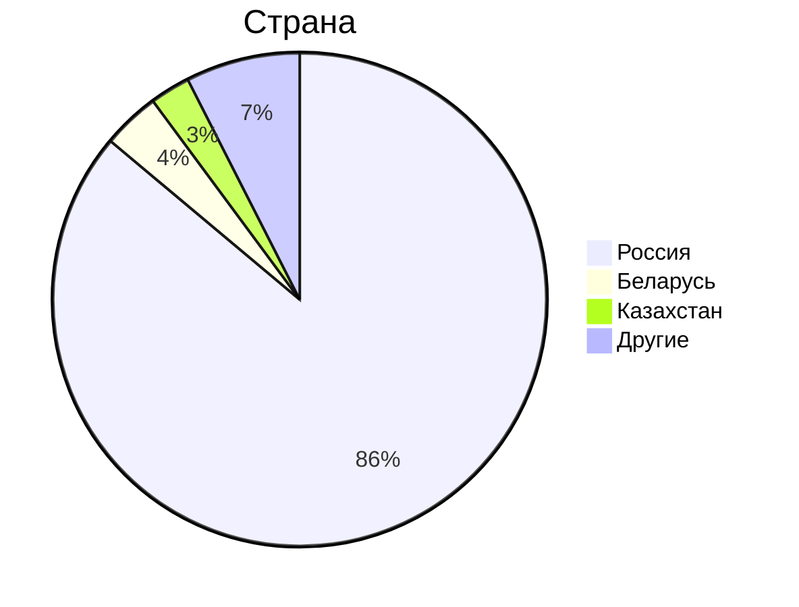

# 1. Тема, MVP, анализ аудитории.
**Облако Mail.ru** - облачный сервис для хранения и обмена файлами.

### MVP
1. Загрузка файлов на облако;
2. Скачивание файлов с облака;
3. Синхронизация файлов между разными устройствами на одном аккаунте;
4. Возможность поделиться хранилищем с другим человеком по ссылке;

## Ключевое продуктовое решение
Письма и вложения из почты mail.ru автоматически загружаются в облако.

### Анализ трафика
- MAU - 23 млн.[^1]
- DAU - 2.5 млн.[^1]
- За год пользователи загружают 30 млрд. файлов[^2]
- В день пользователи почты mail.ru получают 500млн писем[^4], которые необходимо загрузить в облако.
- Общий объем хранилища составляет 600 петабайт[^2]

### Анализ аудитории
По данным сайта Similarweb[^3] аудитория распределяется следующим образом:

Таким образом, можно сказать, что вся ключевая аудитория располагается на территории СНГ.

## Отличия от конкурентов
Главным отличием от конкурентов в лице Google Drive, Dropbox и других облачных хранилищ является направленность на аудиторию, расположенную в СНГ. Благодаря тому, что большая часть аудитории располагается в России, все сервера так же можно расположить в России, предоставляя пользователям лучшую скорость работы. От конкурента в лице Яндекс 360, "облако" отличает интеграция с почтовыми сервисами. 

# 2. Расчет нагрузки
## Продуктовые метрики
- **Средний размер хранилища мользователя** - рассмотрим только бесплатную подписку, в которой каждый пользователь получает 8 ГБ свободного места.
- **Среднее количество действий пользователя** - т.к. за год пользователи загружают 29.3 млрд. файлов[^5], то это в среднем 80 млн. файлов в день. Исходя из дневной аудитории в 2.5 млн. пользователей можно предположить, что в день средний пользователь загружает 32 файла. Предположим, что пользователи скачивают в день столько же файлов, сколько и загружают.

Итого:
Параметр | Значение
------ | ------
Месячная аудитория | 23 млн. человек
Дневная аудитория | 2.5 млн. человек
Средний размер хранилища пользователя | 8 Гб
Загрузка файлов | 32 файла/день
Скачивание файлов | 32 запросов/день

## Технические метрики
### Размер хранения в разбивке по типам данных
Число пользователей в месяц 23 млн. => размер хранения данных = 23 млн. * 8 Гб = 184 Пб.

### Сетевой трафик
Посчитаем сетевой трафик при загрузке файла на облако и скачивании файла с облака. Найти информацию о среднем весе одного файла не удалось, поэтому, основываясь на том, что в основном пользователи хранят на облаке изображения со средним весом 1.75 Мб и реже mp4[^5], средний вес которых находится в пределах 100-500 Мб, примем средний вес одного файла равным 20 Мб.
- **Загрузка файлов на облако** - 32 запроса/день * 20 Мб = 640 Мб/день;
- **Скачивание файлов с облака** - 640 Мб/день;

Тогда средний суточный трафик загрузки и скачивания будет равен: 2.5 млн. * (32 запроса/день / 86400) * 20 Мб * 8 / 1024 = 144 Гбит/с. Пиковый показатель будет равен 288 Гбит/с. Всего за сутки трафик будет составлять: 2.5 млн * 32 запроса/день * 20 Мб / 1024 = 1562500 Гб/сутки.

Для дальнейших расчетов примем, что пиковое значение выше среднего в 2 раза.
Тип трафика | Пиковое в Гбит/c | Суммарный суточной Гб/cутки
------ | ----- | -----
Загрузка файла | 288 | 1562500
Скачивание файла | 288 | 1562500
Итого | 576 | 3125000

### RPS
Посчитаем RPS в предположении, что пиковый RPS будет в 2 раза выше среднего.

Запрос | средний RPS | Пиковый RPS  | 
------ | ------ | -----
Загрузка файла | 2.5 млн * 32 / 86400 = 925 | 1850
Скачивание файла | 2.5 млн * 32 / 86400 = 925 | 1850
Итого | 1850 | 3700

## Список источников
[^1]: [Заявления компании об активных пользователях](https://habr.com/ru/news/711772/)
[^2]: [Объем пользовательских данных в Облаке Mail.ru](https://hi-tech.mail.ru/news/102223-raskryit-obem-polzovatelskih-dannyih-v-oblake-mailru/)
[^3]: [Аналитика трафика cloud.mail.ru](https://www.similarweb.com/website/cloud.mail.ru/#ranking)
[^4]: [Дневная нагрузка почты mail.ru](https://www.cnews.ru/news/line/2023-10-18_pochta_mailru_obrabatyvaet)
[^5]: [Загружаемые файлы облака mail.ru](https://searchengines.guru/ru/news/2058384)
