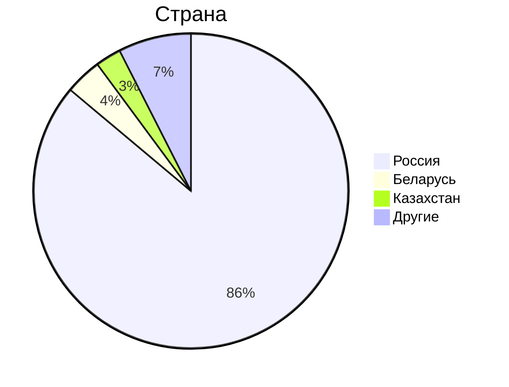
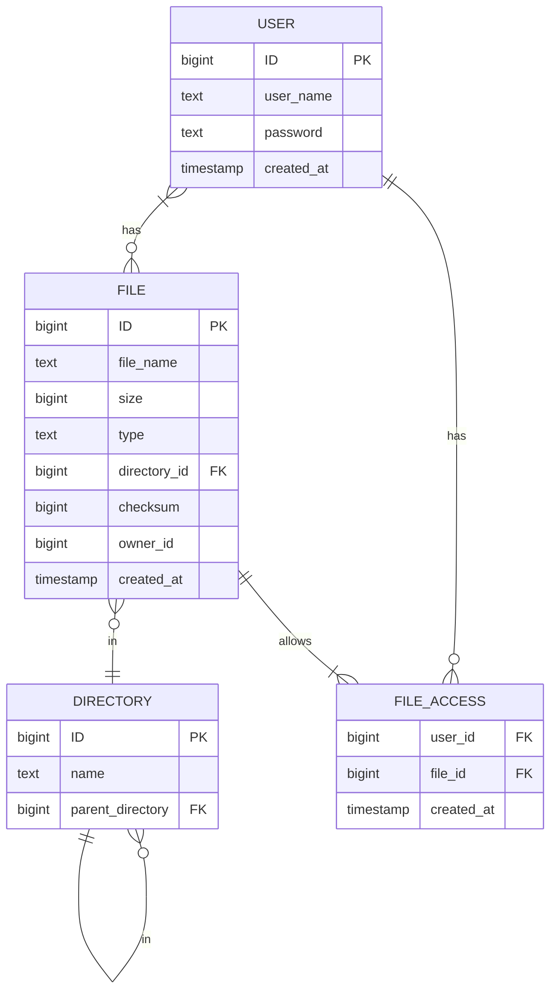

# 1. Тема, MVP, анализ аудитории.
**Облако Mail.ru** - облачный сервис для хранения и обмена файлами.

### MVP
1. Загрузка файлов на облако;
2. Скачивание файлов с облака;
3. Возможность создания директорий для распределения по ним файлов;
4. Отображение файлов и директорий списокм (листинг);
5. Отображение метаинформации о файле (название, формат, вес, дата добавления);
6. Возможность предоставить доступ к хранилищу или к папке другому человеку;

### Анализ трафика
- MAU - 23 млн.[^1]
- DAU - 2.5 млн.[^1]. Примем во внимание, что речь в заявлении идет о пользователях ресурса без учета пользователей мобильного приложения.
- За год пользователи загружают 30 млрд. файлов[^2]
- Общий объем хранилища составляет 600 петабайт[^2]

### Анализ аудитории
По данным сайта Similarweb[^3] аудитория распределяется следующим образом:

Таким образом, можно сказать, что вся ключевая аудитория располагается на территории СНГ.

## Отличия от конкурентов
От конкурентов в лице Google Drive, Dropbox и других облачных хранилищ, "облако" отличает интеграция с почтовыми сервисами. 

# 2. Расчет нагрузки
## Продуктовые метрики
- **Средний размер хранилища мользователя** - так как компания не разглашает информацию о среднем хранилище пользователя, я провел опрос с участием 100 человек и установил, что средний размер облачного хранилища пользователя составляет 37 Гб.
- **DAU** - 2.5 млн. Как уже было сказано ранее, это пользователи ресурса без учета мобильного приложения. Основываясь на том, что основная доля пользователей Облака Mail.ru из России и того, что доля мобильного трафика в России составляет 45,3%[^6], то примем DAU равным 4.6 млн, полагая, что все пользователи мобильных устройств используют мобильное приложения.
- **Среднее количество действий пользователя** - т.к. за год пользователи загружают 29.3 млрд. файлов[^5], то это в среднем 80 млн. файлов в день. Исходя из дневной аудитории в 4.6 млн. пользователей можно предположить, что в день средний пользователь загружает 17 файлов. Такой большое значение связано, скорее всего, с тем, что у мобильного и десктопного приложение есть возможность автоматически загружать на облако данные из галереи на телефоне, либо же из выбранной папки на компьютере. Примем число загрузок файлов равным числу скачиваний.

Нам также понадобится хранить различные метаданные пользователей и файлов: имя пользователя, ID пользователя, имя файла, путь к нему в файловом хранилище, является ли файл директорией и т.д. Рассмотрим примерную схему БД метаданных:

Посчитаем теперь сколько метаинформации придется дополнительно хранить, ограничив длину текста 30 символами:
Тип данных | Размер
------ | ------
Bigint | 8 байт
Text | 31 байт
Boolean | 1 байт
Timestamp | 8 байт

Тогда для каждого пользователя мы дополнительно храним 78 байт. Для каждого файла мы дополнительно храним 110 байт и также мы храним директории для организации файлов весом 23 байта.
Найти информацию о среднем весе одного файла не удалось, поэтому, основываясь на том, что в основном пользователи хранят на облаке изображения со средним весом 1.75 Мб, чуть реже PDF со средним весом 1.5 Мб и еще реже mp4 со средним весом 300 Мб[^5] проведем расчеты. В пятерке самых распространенных файлов первые 3 места занимают изображения в разных форматах, 4 место PDF и 5 место MP4. На основе этих данных предположим, что 50% файлов, хранимых пользователями - фото, 30% - документы, 15% - видео, и 5% - прочие файлы весом 0-20 МБ. Тогда средний размер одного файла 0.5 * 1.75 Мб + 0.3 * 1.5 Мб + 0.15 * 300Мб + 0.05 * 10Мб = 47 Мб.

Предположим, что средний пользователь просматривает информацию о каждом файле до скачивания. Также пусть пользователь 3 раза в день заправшивает список файлов и этот список будет содержать максимум 20 файлов.

Итого:
Параметр | Значение
------ | ------
Месячная аудитория | 23 млн. человек
Дневная аудитория | 4.6 млн. человек
Средний размер хранилища пользователя | 37 Гб
Средний размер одного файла | 47 Мб
Загрузка файлов | 17 файлов/день
Скачивание файлов | 17 файлов/день
Листинг | 3 запроса по 20 файлов в день
Метаинформация о файле | 17 запросов/день
Метаданные пользователя | 78 байт
Метаданные файла | 119 байт

## Технические метрики
### Размер хранения
Компания утверждает, что размер хранилища составляет 600 Пб[^2].
### Сетевой трафик
Посчитаем сетевой трафик при загрузке файла на облако и скачивании файла с облака. Также нам нужно
- **Загрузка файлов на облако** - 17 запроса/день * (47 Мб + 119 байт) = 340 Мб/день;
- **Скачивание файлов с облака** - 340 Мб/день;

Тогда средний суточный трафик загрузки и скачивания будет равен: 4.6 млн. * (17 запроса/день / 86400) * (47 Мб + 119 байт) * 8 / 1024 = 333 Гбит/с. Пиковый показатель будет равен 288 Гбит/с. Всего за сутки трафик будет составлять: 4.6 млн * 17 запроса/день * (47 Мб + 119 байт) / 1024 = 3589268 Гб/сутки.

При запросе списка из 20 файлов мы запрашиваем только название (text весом 31 байт) и формат (text весом 7 байт). Получаем, что за день 4.6млн * (3 запроса/день /86400) * (38 байт) * 8 = 47,42 Кбит/с. За сутки 4.6 млн * 3 запроса/день * (38 байт) = 0.5 Мб/сутки
При запросе метаинформации о файле мы запрашиваем его название (31 байт), его формат (7 байт), его размер (8 байт) и дату создания (8 байт). Итого 54 байта. Пиковый показатель 4.6млн * (17 запросов/день / 86400) * (54 байта) * 8 = 47,73 Кбит/с. За сутки 4.6млн * 17 * 54 байта = 31 ГБ/сутки

Для дальнейших расчетов примем, что в пиковые часы мы будем ограничивать трафик, так как скорость передачи информации не играет существенной роли в контексте облачных сервисов. 
Так как каналы дуплексные, то итоговые значения не нужно скалдывать, так как загрузка и скачивание происходят параллельно.

Тепер
Тип трафика | Пиковое в Гбит/c | Суммарный суточной Гб/cутки
------ | ----- | -----
Загрузка файла | 333 | 3589268
Скачивание файла | 333 | 3589268
Листинг файлов | 47,42 * 2 ^ (-20)| 0,5 * 2^(-10)
Отображение информации о файле | 47,42 * 2 ^ (-20) | 31
Итого | 333 | 3589299

### RPS
Посчитаем RPS в предположении, что пиковый RPS будет в 2 раза выше среднего.

Запрос | средний RPS | Пиковый RPS  | 
------ | ------ | -----
Загрузка файла | 4.6 млн * 17 / 86400 = 905 | 1810
Скачивание файла | 4.6 млн * 17 / 86400 = 905 | 1810
Листинг файлов | 4.6млн * 3 / 86400 = 160 | 320
Отображение информации о файле | 4.6 млн * 17 / 86400 = 905 | 1810
Итого | 2875 | 5750

## Глобальная балансировка нагрузки
Исходя из данных similarweb основная часть пользователей находится в России[^3]. Значит, для глобальной балансировки нагрузки можно обойтись без DNS-балансировки, так как нам нужна балансировка внутри страны. Теперь нужно разобраться с расположением датацентров внутри страны. Наибольшее количество пользователей проживает в Москве, Санкт-Петербурге, Уфе, Краснодаре и Новосибирске. Значит, нужно расположить датацентры в этих городах. Стоит принять во внимание, что в этом списке нет ни одного города на Дальнем Востоке. Основываясь на численности населения, установим датацентр в Хабаровске, чтобы у пользователей из Дальнего Востока был датацентр поблизости. Посмотреть насположение серверов можно на карте:

Теперь эти датацентры необходимо объединить в автономную систему (AS) и объявить на всех узлах один IP-адрес через BGP. Так, маршрутизаторы сами будут направлять запросы пользователей в ближайший датацентр.

## Список источников
[^1]: [Заявления компании об активных пользователях](https://habr.com/ru/news/711772/)
[^2]: [Объем пользовательских данных в Облаке Mail.ru](https://hi-tech.mail.ru/news/102223-raskryit-obem-polzovatelskih-dannyih-v-oblake-mailru/)
[^3]: [Аналитика трафика cloud.mail.ru](https://www.similarweb.com/website/cloud.mail.ru/#ranking)
[^4]: [Дневная нагрузка почты mail.ru](https://www.cnews.ru/news/line/2023-10-18_pochta_mailru_obrabatyvaet)
[^5]: [Загружаемые файлы облака mail.ru](https://searchengines.guru/ru/news/2058384)
[^6]: [Анализ использования Интернета за 2024 год](https://www.meltwater.com/en/2024-global-digital-trends)
[^7]: [Средний размер файла в облачном хранилище](https://www.globaldots.com/resources/blog/how-much-is-stored-in-the-cloud/)
[^8]: [Интерес к облачных хранилищам в России](https://www.yota.ru/corporate/press/1124222)
