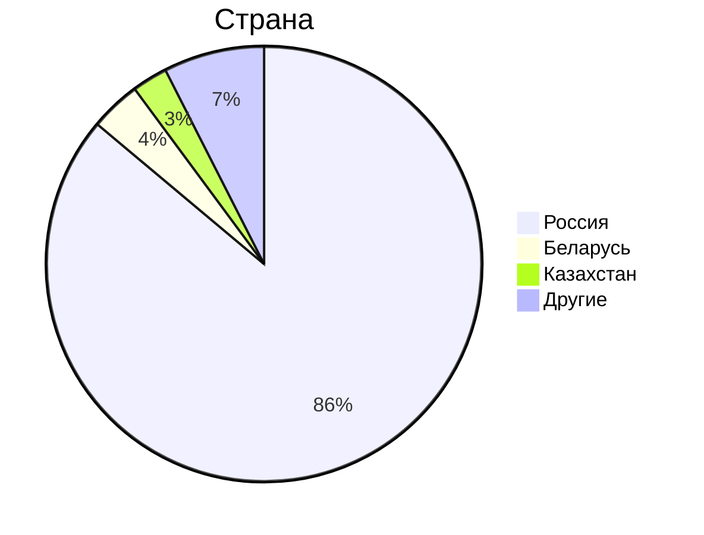

# 1. Тема, MVP, анализ аудитории.
**Облако Mail.ru** - облачный сервис для хранения и обмена файлами.

### MVP
1. Загрузка файлов на облако;
2. Скачивание файлов с облака;
3. Синхронизация файлов между разными устройствами на одном аккаунте;
4. Возможность поделиться хранилищем с другим человеком по ссылке;

## Ключевое продуктовое решение
Письма и вложения из почты mail.ru автоматически загружаются в облако.

### Анализ трафика
- MAU - 23 млн.[^1]
- DAU - 2.5 млн.[^1]
- За год пользователи загружают 30 млрд. файлов[^2]
- В день пользователи почты mail.ru получают 500млн писем[^4], которые необходимо загрузить в облако.

### Анализ аудитории
По данным сайта Similarweb[^3] аудитория распределяется следующим образом:

Таким образом, можно сказать, что вся ключевая аудитория располагается на территории СНГ.

## Отличия от конкурентов
Главным отличием от конкурентов в лице Google Drive, Dropbox и других облачных хранилищ является направленность на аудиторию, расположенную в СНГ. Благодаря тому, что большая часть аудитории располагается в России, все сервера так же можно расположить в России, предоставляя пользователям лучшую скорость работы. От конкурента в лице Яндекс 360, "облако" отличает интеграция с почтовыми сервисами. 

## Список источников
[^1]: [Заявления компании об активных пользователях](https://habr.com/ru/news/711772/)
[^2]: [Объем пользовательских данных в Облаке Mail.ru](https://hi-tech.mail.ru/news/102223-raskryit-obem-polzovatelskih-dannyih-v-oblake-mailru/)
[^3]: [Аналитика трафика cloud.mail.ru](https://www.similarweb.com/website/cloud.mail.ru/#ranking)
[^4]: [Дневная нагрузка почты mail.ru](https://www.cnews.ru/news/line/2023-10-18_pochta_mailru_obrabatyvaet)
