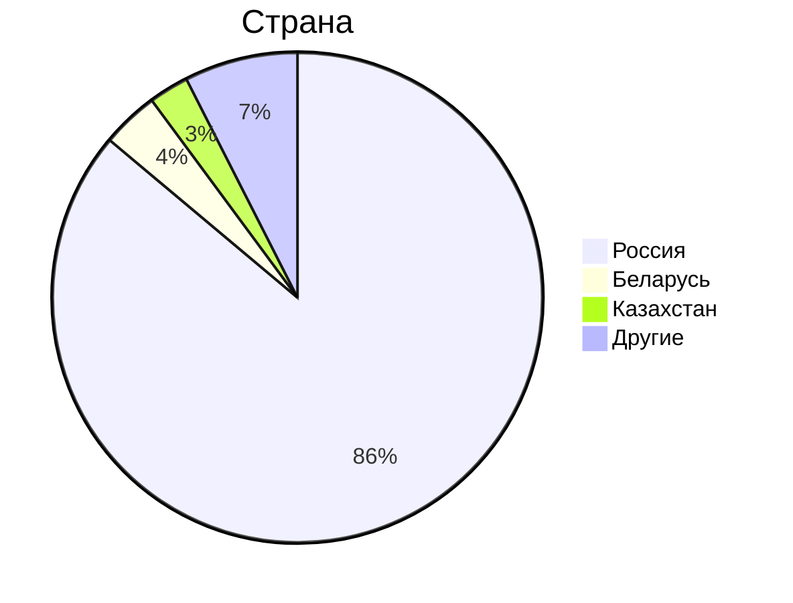

# 1. Тема, MVP, анализ аудитории.
**Облако Mail.ru** - облачный сервис для хранения и обмена файлами.

### MVP
1. Загрузка файлов;
2. Просмотр и скачивание файлов;
3. Возможность поделиться хранилищем (например доступ по ссылке);
4. Просмотр фото и видео без необходимости скачивания;
5. Возможность управлять доступным пользователю местом;

### Ключевое продуктовое решение
Ключевым продуктовым решением является интеграция с почтой Mail.ru и использование ML технологий. Так, вложения из писем автоматически могут отправляться в облако, а алгоритмы машинного обучения могут формировать подборки из сохраненных фотографий.

### Анализ трафика
В соответствии с заявлениями самой комании на январь 2023 года имеем следующие основные цифры:
- MAU - 23 млн.
- DAU - 2.5 млн.

### Анализ аудитории
По данным сайта Similarweb аудитория распределяется

Таким образом, можно сказать, что вся ключевая аудитория располагается на территории СНГ.
