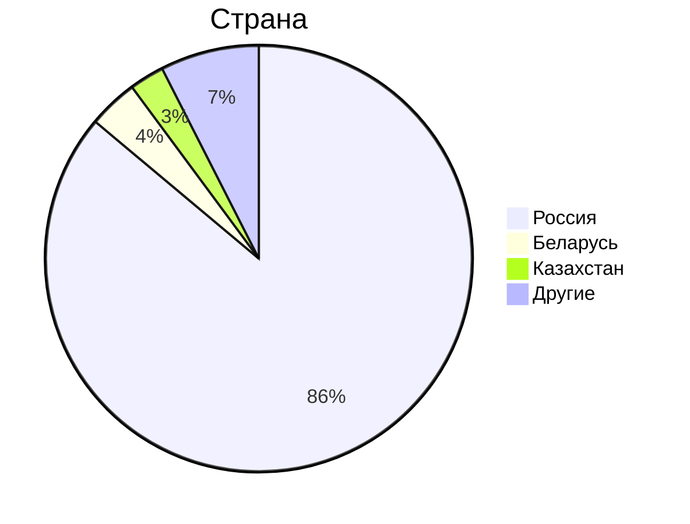
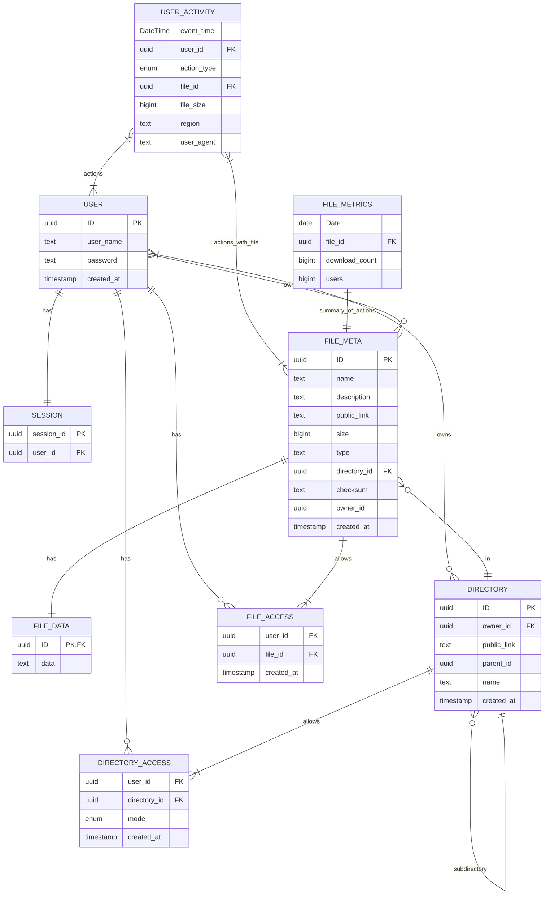
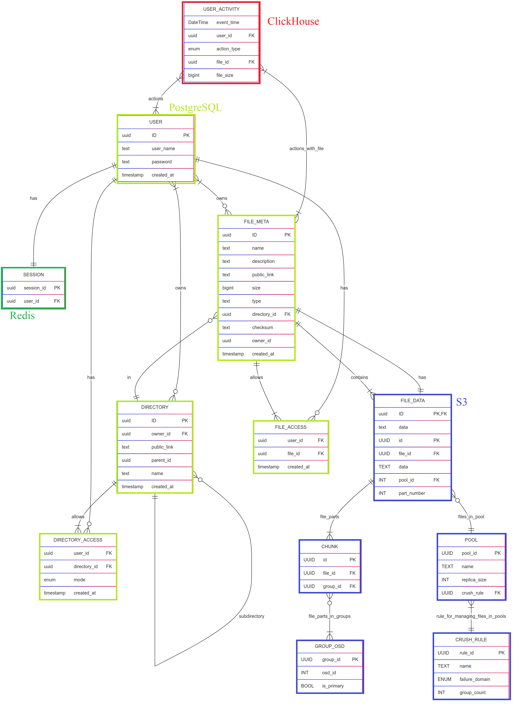

# 1. Тема, MVP, анализ аудитории.
**Облако Mail.ru** - облачный сервис для хранения и обмена файлами.

### MVP
1. Загрузка файлов на облако;
2. Скачивание файлов с облака;
3. Возможность создания директорий для распределения по ним файлов;
4. Отображение файлов и директорий списокм (листинг);
5. Отображение метаинформации о файле (название, формат, вес, дата добавления);
6. Возможность предоставить доступ к хранилищу или к папке другому человеку;

### Анализ трафика
- MAU - 23 млн.[^1]
- DAU - 2.5 млн.[^1]. Примем во внимание, что речь в заявлении идет о пользователях ресурса без учета пользователей мобильного приложения.
- За год пользователи загружают 30 млрд. файлов[^2]
- Общий объем хранилища составляет 600 петабайт[^2]

### Анализ аудитории
По данным сайта Similarweb[^3] аудитория распределяется следующим образом:

Таким образом, можно сказать, что вся ключевая аудитория располагается на территории СНГ.

## Отличия от конкурентов
От конкурентов в лице Google Drive, Dropbox и других облачных хранилищ, "облако" отличает интеграция с почтовыми сервисами. 

# 2. Расчет нагрузки
## Продуктовые метрики
- **Средний размер хранилища мользователя** - так как компания не разглашает информацию о среднем хранилище пользователя, я провел опрос с участием 100 человек и установил, что средний размер облачного хранилища пользователя составляет 37 Гб.
- **DAU** - 2.5 млн. Как уже было сказано ранее, это пользователи ресурса без учета мобильного приложения. Основываясь на том, что основная доля пользователей Облака Mail.ru из России и того, что доля мобильного трафика в России составляет 45,3%[^6], то примем DAU равным 4.6 млн, полагая, что все пользователи мобильных устройств используют мобильное приложения.
- **Среднее количество действий пользователя** - т.к. за год пользователи загружают 29.3 млрд. файлов[^5], то это в среднем 80 млн. файлов в день. Исходя из дневной аудитории в 4.6 млн. пользователей можно предположить, что в день средний пользователь загружает 17 файлов. Такой большое значение связано, скорее всего, с тем, что у мобильного и десктопного приложение есть возможность автоматически загружать на облако данные из галереи на телефоне, либо же из выбранной папки на компьютере. Ввиду того, что мы разрабатываем MVP - опустим функцию синхронизации облачного хранилища с хранилищем на телефоне или ПК. Тогда, примем число ручных загрузок файлов равным 3, а число скачиваний равным 6.

Найти информацию о среднем весе одного файла не удалось, поэтому, основываясь на том, что в основном пользователи хранят на облаке изображения со средним весом 1.75 Мб, чуть реже PDF со средним весом 1.5 Мб и еще реже mp4 со средним весом 300 Мб[^5] проведем расчеты. В пятерке самых распространенных файлов первые 3 места занимают изображения в разных форматах, 4 место PDF и 5 место MP4. На основе этих данных предположим, что 50% файлов, хранимых пользователями - фото, 30% - документы, 15% - видео, и 5% - прочие файлы весом 0-20 МБ. Тогда средний размер одного файла 0.5 * 1.75 Мб + 0.3 * 1.5 Мб + 0.15 * 300Мб + 0.05 * 10Мб = 47 Мб.

Предположим, что средний пользователь просматривает информацию о каждом файле до скачивания. Также пусть пользователь 3 раза в день заправшивает список файлов и этот список будет содержать максимум 20 файлов.

Итого:
Параметр | Значение
------ | ------
Месячная аудитория | 23 млн. человек
Дневная аудитория | 4.6 млн. человек
Средний размер хранилища пользователя | 37 Гб
Средний размер одного файла | 47 Мб
Загрузка файлов | 3 файлов/день
Скачивание файлов | 6 файлов/день
Листинг | 3 запроса по 20 файлов в день
Метаинформация о файле | 6 запросов/день
Метаданные пользователя | 78 байт
Метаданные файла | 119 байт

## Технические метрики
### Размер хранения
Компания утверждает, что размер хранилища составляет 600 Пб[^2].
### Сетевой трафик
Посчитаем сетевой трафик при загрузке файла на облако и скачивании файла с облака. Также нам нужно
- **Загрузка файлов на облако** - 3 запроса/день * (47 Мб) = 141 Мб/день;
- **Скачивание файлов с облака** - 282 Мб/день;

Тогда средний суточный трафик загрузки будет равен: 4.6 млн. * (3 запроса/день / 86400) * (47 Мб) * 8 / 1024 = 58 Гбит/с. Для скачивания трафик будет, соответственно, равен 116 Гбит/с. Всего за сутки трафик загрузки будет составлять: 4.6 млн * 3 запроса/день * (47 Мб) / 1024 = 633400 Гб/сутки. Суточный трафик скачивания - 1266800 Гб/сутки.

При запросе списка из 20 файлов мы запрашиваем только название (text весом 31 байт) и формат (text весом 7 байт). Получаем, что за день 4.6млн * (3 запроса/день /86400) * (38 байт) * 8 = 47,42 Кбит/с. За сутки 4.6 млн * 3 запроса/день * (38 байт) = 500 Мб/сутки.
При запросе метаинформации о файле мы запрашиваем его название (31 байт), его формат (7 байт), его размер (8 байт) и дату создания (8 байт). Итого 54 байта. Пиковый показатель 4.6млн * (6 запросов/день / 86400) * (54 байта) * 8 = 135 Кбит/с. За сутки 4.6млн * 6 * 54 байта = 1,4 ГБ/сутки.

Для дальнейших расчетов примем, что в пиковые часы мы будем ограничивать трафик, так как скорость передачи информации не играет существенной роли в контексте облачных сервисов. 
Так как каналы дуплексные, то итоговые значения не нужно скалдывать, так как загрузка и скачивание происходят параллельно.

Тип трафика | Пиковое в Гбит/c | Суммарный суточной Гб/cутки
------ | ----- | -----
Загрузка файла | 58 | 633400
Скачивание файла | 116 | 1266800
Листинг файлов | 47,42 * 2 ^ (-20)| 0,5
Отображение информации о файле | 135 * 2 ^ (-20) | 1,4
Итого | 116 | 1266801

### RPS
Посчитаем RPS в предположении, что пиковый RPS будет в 2 раза выше среднего.

Запрос | средний RPS | Пиковый RPS 
------ | ------ | -----
Загрузка файла | 4.6 млн * 3 / 86400 = 160 | 320
Скачивание файла | 4.6 млн * 6 / 86400 = 320 | 640
Листинг файлов | 4.6млн * 3 / 86400 = 160 | 320
Отображение информации о файле | 4.6 млн * 6 / 86400 = 320 | 640
Итого | 960 | 1920

## Глобальная балансировка нагрузки
### Функциональное разбиение по доменам
- Основной домен (точка входа): cloud.mail.ru;
- Отдача статики: static-XX.cloud.mail.ru (XX - номер сервера);
- Отдача динамического контента (листинга файлов, метаинформации): api.cloud.mail.ru;
- Загрузка файлов в хранилище: s3-XX.cloud.mail.ru (XX - номер сервера);
### Расположение датацентров
Исходя из данных similarweb основная часть пользователей находится в России[^3]. Значит, для глобальной балансировки нагрузки можно обойтись без DNS-балансировки, так как нам нужна балансировка внутри страны.

Теперь нужно разобраться с расположением датацентров внутри страны. Наибольшее количество пользователей проживает в Москве, Санкт-Петербурге, Уфе, Краснодаре и Новосибирске. Значит, нужно расположить датацентры в этих городах. Стоит принять во внимание, что в этом списке нет ни одного города на Дальнем Востоке. Основываясь на численности населения, установим датацентр в Хабаровске, чтобы у пользователей из Дальнего Востока был датацентр поблизости. Посмотреть насположение серверов можно на карте:

### Функционал датацентров
Основной домен (cloud.mail.ru) и домен для отдачи динамического контента (api.cloud.mail.ru) расположим в датацентре Москве.

CDN для отдачи статики (static-XX.cloud.mail.ru) и S3 хранилища расположим в ДЦ в Москве, Санкт-Петербурге, Уфе, Краснодаре, Новосибирске и Хабаровске.

### Расчет плотности запросов
Сделаем выводы о распределении плотности нагрузки на основании плотности населения:
Учтем не только население городов, но и население субъектов федерации, в которых эти города находятся:
- Москва: 12,6 млн человек.
- Санкт-Петербург: ~5,6 млн человек.
- Республика Башкортостан (субъект федерации, где находится Уфа): ~4,1 млн человек.
- Краснодарский край (субъект федерации, где находится Краснодар): ~5,8 млн человек.
- Новосибирская область (субъект федерации, где находится Новосибирск): ~2,8 млн человек.
- Дальневосточный федеральный округ (ДФО): ~8,1 млн человек.

Тогда получаем следующее распределение трафика:
- Москва: весь трафик API + 32% трафика CDN
- Санкт-Петербург: 14% трафика CDN
- Уфа: 11% трафика CDN
- Краснодар: 15% трафика CDN 
- Новосибирск: 7% трафика CDN
- Хабаровск: 21% трафика CDN

| Тип запроса                    | Москва, RPS | Санкт-Петербург CDN, RPS | Уфа CDN, RPS            | Краснодар CDN, RPS    | Новосибирск CDN, RPS | Хабаровск CDN, RPS |
|--------------------------------|-------------|--------------------------|-------------------------|-----------------------|----------------------|--------------------|
| Загрузка файла                 | 103         | 45                       | 35                      | 48                    | 23                   | 67                 |
| Скачивание файла               | 206         | 90                       | 70                      | 96                    | 46                   | 134                |
| Листинг файлов                 | 320         | 0                        | 0                       | 0                     | 0                    | 0                  |
| Отображение информации о файле | 640         | 0                        | 0                       | 0                     | 0                    | 0                  |
| Итого                          | 1269        | 135                      | 105                     | 144                   | 69                   | 201                |

### Схема балансировки
Для балансировки нагрузки будем использовать технологию BGP Anycast:
- Все датацентры объединяются в одну автономную систему и анонсируют один IP адрес, благодаря чему все запросы с помощью технологии BGP Anycast приходят на ближайший датацентр. 
- Во всех датацентрах установлены CDN сервера и S3 хранилища. Если файл, запрашиваемый пользователем, отсутсвтует на CDN сервере, то совершается запрос к S3 хранилищу, после чего полученный файл кешируется CDN сервером.
- Если один из ДЦ выходит из строя, то весь трафик автоматически перенаправляется в другой ближайший ДЦ. 

## Локальная балансировка нагрузки
Итак, трафик пришел в датацентр после глобальной балансировки нагрузки. Теперь нужно придумать способ добавить балансировку внутри самого датацентра. Разумно будет установить L7-балансировщик, но необходимо сделать систему отказоустойчивой, поэтому добавим к нему L4-балансировку.

## L4-балансировщик
Для L4-балансировки будем использовать Virtual Server via Direct Routing. С его помощью мы будем распределять нагрузку между L7-балансировщиками. Мы можем применить эту технологию, так как работаем внутри одного датацентра и L4 и L7 балансировщики находятся в одной подсети.

Для обеспечения отказоустойчивости необходимо следить за состоянием L7-балансировщиков. Используем сервис Keepalived, который будет делать запросы на L7-балансировщики и проверять их состояние.

## L7-балансировка
Установим внутри каждого датацентра веб-сервер с установленным nginx, который будет выоплнять следующий функции:
- Проксирование запросов к файловому хранилищу;
- Обратное проксирование;
- Терминация SSL;
- Распределение запросов по серверам API;
- Ограничение частоты запросов;
- Поддержание keepalive-соединений;
- Сжатие данных;
- Установка таймаутов;
- Перенаправление идемпотентных запросов с нерабочего сервера на рабочий;

## Управление stateless-сервисами
Для масштабирования stateless-сервисов развернем кластер Kubernetes, в рамках которого Nginx выступает в роли Ingress-контроллера и L7-балансировщика. Kubernetes автоматически управляет масштабированием и обновлением инстансов Nginx, отслеживая состояние подов с помощью readiness и liveness probes. При изменении нагрузки или отказе отдельных компонентов Kubernetes оперативно перезапускает или масштабирует Nginx. Для Service Discovery будем использовать etcd.  

### Терминация SSL
Терминация SSL создаст дополнительную нагрузку на процессор. Примем во внимание, что средний размер SSL-сессии - 1 КБ, а средняя нагрузка современных алгоритмов шифрования на процессор составляет 0,75 мс на одно соединение. Тогда **объем данных = RPS * 1 Кб**, **Необходимые ядра = RPS * 0,75 мс**.

| Датацентр       | RPS    | Объем данных КБ/с | Требуемые ядра CPU |
|-----------------|--------|-------------------|--------------------|
| Москва          | 1269   | 1269              | 1                  |
| Санкт-Петербург | 135    | 135               | 1                  |
| Уфа             | 105    | 105               | 1                  |
| Краснодар       | 144    | 144               | 1                  |
| Новосибирск     | 69     | 69                | 1                  |
| Хабаровск       | 201    | 201               | 1                  |

### Логическая схема БД

Нам также понадобится хранить различные метаданные пользователей и файлов: имя пользователя, ID пользователя, имя файла, путь к нему в файловом хранилище, является ли файл директорией и т.д. Рассмотрим примерную схему БД метаданных:

### Описание схемы БД
Таблица          | Описание
-----------------| ------
USER             | Таблица с информацией о пользователе
SESSION          | Информация о сессиях пользователя
FILE_META        | Таблица, содержащая основную метаинформацию о файле
FILE_DATA        | Сам файл
USER_ACTIVITY    | Данные о действиях пользователя. Поле action_type принимает следующие значения: upload, download, delete, share.
FILE_METRICS     | Данные о файлах для аналитики. Содержит информацию о загрузках и скачиваниях файла, а также о пользователях, взаимодействовавших с файлом
DIRECTORY        | Таблица со списком директорий. У каждой директории есть родительская директория, так что можно создавать директории внутри директорий
FILE_ACCESS      | Таблица содержит информацию о доступе пользователей к файлам, который они могут скачать и метаинформацию о которых они могут просмотреть
DIRECTORY_ACCESS | Таблица содержит информацию о доступе пользователей к директориям и о режиме доступа: запись (w), чтение (r), чтение и запись (rw). При доступе только на запись у пользователя есть возможность добавлять свои файлы в директорию, но нет возможности видеть чужие файлы. При записи на чтение есть возможность видеть и скачивать чужие файлы.

## RPS таблиц в БД
Каждый запрос на скачивание файла будет создавать запрос на чтение к таблицам FILE_ACCESS и DIRECTORY_ACCESS (640 RPS). При каждой загрузке файла мы будем делать запись в таблицы: FILE_META, FILE_ACCESS. Значит к обоим этим таблицам будут приходить 320 RPS на запись. При листинге файлов мы должны проверить права пользователя на директорию, то есть сделать запрос к таблице DIRECTORY_ACCESS, затем сделать запросы из таблиц FILE_META и DIRECTORY и отобразить нужные файлы и директории. Соответственно у нас будет +320 RPS на чтение в эти таблицы. При отображении информации о файле нужно проверить доступ к файлу в FILE_ACCESS и DIRECTORY_ACCESS, после чего получить метаинформацию о файле из таблицы FILE_META. Значит к этим таблицам добавляется 640 RPS на чтение. Так как создание директорий, предоставление пользователям доступа к файлам и директориям, а также запись и чтение таблицы USER не являются частыми операциями, то ограничим их 100 RPS. Каждый запрос на чтение и запись должен проходить авторизацию, поэтому он будет сопровождаться чтением из таблицы SESSION. Запись в таблицу SESSION происходит не часто, поэтому также ограничим 100 RPS. Каждое действие пользователя должно быть записано в USER_ACTIVITY, а каждое скачивание файла в FILE_METRICS. Получается USER_ACTIVITY(запись) = скачивания(RPS) + загрузки(RPS) + поделиться файлом(RPS), FILE_METRICS(запись) = скачивание файла(RPS). Так как FILE_METRICS и USER_ACTIVITY таблицы для аналитики, то чтение из них будет происходить не часто и мы ограничим его 100 RPS. SESSION(чтение) = загрузка + скачивание + листинг + чтение метаинформации + создание директории + чтение файлов в директории + чтение из аналитических таблиц. Взаимодействие с FILE_DATA происходит при загрузках и скачиваниях.
Таблица          | Запись | Чтение
-----------------|--------|--------
USER             | 100    | 100
SESSION          | 100    | 2540
FILE_META        | 320    | 960  
FILE_DATA        | 320    | 640
USER_ACTIVITY    | 1380   | 100
FILE_METRICS     | 960    | 100
DIRECTORY        | 100    | 320
FILE_ACCESS      | 420    | 1280
DIRECTORY_ACCESS | 100    | 1920

### Строки таблиц
Предположим, что у нас зарегистрировано в 2 раза числа ежемесячно активных пользователей. Тогда в таблице USER будет 2 * MAU = 2 * 23 млн. = 46 млн. строк. 

В таблице SESSION мы храним сессии активных пользователей, которые будут протухать раз в месяц. Также предположим, что половина пользователей с предыдущего месяца продолжает пользоваться сервисом, а значит их сессии не удаляются из таблиц. Получаем MAU + 0.5 * MAU = 35 млн.

По заявлениям компании файлы занимают 600 петабайт. Тогда, учитывая, что средний размер файла составляет 47 мб, то всего мы будем хранить (600 * 2^(50)) / (47 * 2^(20)) = 13.7 млрд. файлов. Так как в таблицах FILE_META и FILE_METRICS каждая строка соответствует одному файлу, то в них так же будет 13.7 млрд. строк.

Если в таблице USER_ACTIVITY мы храним информацию о пользовательской активности в течение месяца, то тогда ней будет 1380(RPS на запись) * 60 * 60 * 24 * 30 = 3.58 млрд. строк. 

Учитывая, что создание новых директорий мы ограничили 100 RPS, в то время как создание файлов имеет 320 RPS, то мы можем предположить, что директорий в худшем случае будет в 3 раза меньше, чем файлов. Тогда в таблице будет 4.5 млрд строк.

Так как в таблицу FILE_ACCESS записывают на 1/3 больше, чем в таблицу FILE_META, то мы можем предположить, что в таблице FILE_ACCESS будет на 1/3 больше строк, то есть 17.8 млрд.

В таблице DIRECTORY_ACCESS помимо информации о доступе к каждой директории ее создателя должна быть информация о других пользователях. Предположим, что в этой таблице так же будет на 1/3 строк больше, чем в таблице DIRECTORY.

Таблица          | Число строк  
-----------------|--------
USER             | 46 млн.     
SESSION          | 35 млн.       
FILE_META        | 13.7 млрд.      
FILE_DATA        | 13.7 млрд.       
USER_ACTIVITY    | 3.58 млрд.       
FILE_METRICS     | 13.7 млрд.       
DIRECTORY        | 4.5 млрд.    
FILE_ACCESS      | 17.8 млрд.    
DIRECTORY_ACCESS | 5.85 млрд.

## Физическая схема БД
### Запросы
Для начала определим, какие запросы мы будем делать.
1. Проверка доступа пользователя к файлу: SELECT COUNT(*) FROM file_access WHERE user_id = $1 AND file_id = $2;
2. Проверка доступа пользователя к директории: SELECT mode FROM directory_access WHERE user_id = $1 AND directory_id = $2;
3. Вывод метаинформации о файле: SELECT * FROM file_meta WHERE ID = $1;
4. Листинг файлов в директории: SELECT name, 'directory' AS type, NULL AS size, created_at FROM directory WHERE parent_id = $1 UNION SELECT name, type, size, created_at FROM file_meta WHERE directory_id = $1;
5. Поиск по файлам и директориям: SELECTF name, 'directory' AS type, NULL AS size, created_at FROM directory WHERE owner_id = $1 AND name LIKE '%' || $2 || '%' UNION SELECT name, type, size, created_at WHERE owner_id = $1 AND name LIKE $2 || '%';
### Индексы
Основываясь на описанных выше запросах следующие индексы должны ускорить работу
1. CREATE INDEX idx_file_access ON file_access(user_id, file_id); - для поиска пользователей, у которых есть доступ к файлу
2. CREATE INDEX idx_directory_access ON directory_access(user_id, directory_id); - для поиска пользователей, у которых есть доступ к директории 
3. CREATE INDEX idx_search_file ON file_meta(directory_id); - для листинга файлов внутри директории
4. CREATE INDEX idx_directory_search ON directory(parent_id); - для листинга директорий пользователя
5. CREATE INDEX idx_directory_search ON directory(owner_id); - для поиска директорий пользователя
6. CREATE INDEX idx_file_search ON file_meta(owner_id); - для поиска файлов пользователя  
### Выбор СУБД

### Шардирование 
Шардировать будем по ID пользователей. Изначально создадим вирутальные шарды на машинах с разными инстанцами БД. Далее с помощью взятия остатка хэша от ID определим, в какой шард попадет пользователь. Все файлы и директории, загружаемые пользователем также будут попадать в этот виртуальный шард. Далее, при горизонтальном масштабировании базы, мы будем переносить виртаульные шарды на новые серверы, тем самым масштабируя систему, не меняя hash функцию. Для работы с шардированием будем использовать Citus. В соответствии с их рекомендации на один физический шард будет приходиться 50 виртуальных шардов

Для сопоставления ID пользователя и номера шарда будем использовать lookup таблицу:

CREATE TABLE user_shard_lookup (
    user_id uuid PRIMARY KEY,
    shard_id int
);

### Резервирование
Для данного профиля нагрузок подойдет Master-Slave репликация. У каждого мастера будут по 2 реплики: одна выполняет роль бэкапап и не находится под нагрузкой, в то время как вторая является горячим резервом и дублирует данные на мастере. Так, мы сможем перенести все операции чтения на горячую реплику, тем самым снять часть нагрузки с мастера. Также такая схема позволяет нам снимать бэкапы. 

### Схема БД

## Список источников
[^1]: [Заявления компании об активных пользователях](https://habr.com/ru/news/711772/)
[^2]: [Объем пользовательских данных в Облаке Mail.ru](https://hi-tech.mail.ru/news/102223-raskryit-obem-polzovatelskih-dannyih-v-oblake-mailru/)
[^3]: [Аналитика трафика cloud.mail.ru](https://www.similarweb.com/website/cloud.mail.ru/#ranking)
[^4]: [Дневная нагрузка почты mail.ru](https://www.cnews.ru/news/line/2023-10-18_pochta_mailru_obrabatyvaet)
[^5]: [Загружаемые файлы облака mail.ru](https://searchengines.guru/ru/news/2058384)
[^6]: [Анализ использования Интернета за 2024 год](https://www.meltwater.com/en/2024-global-digital-trends)
[^7]: [Средний размер файла в облачном хранилище](https://www.globaldots.com/resources/blog/how-much-is-stored-in-the-cloud/)
[^8]: [Интерес к облачных хранилищам в России](https://www.yota.ru/corporate/press/1124222)
