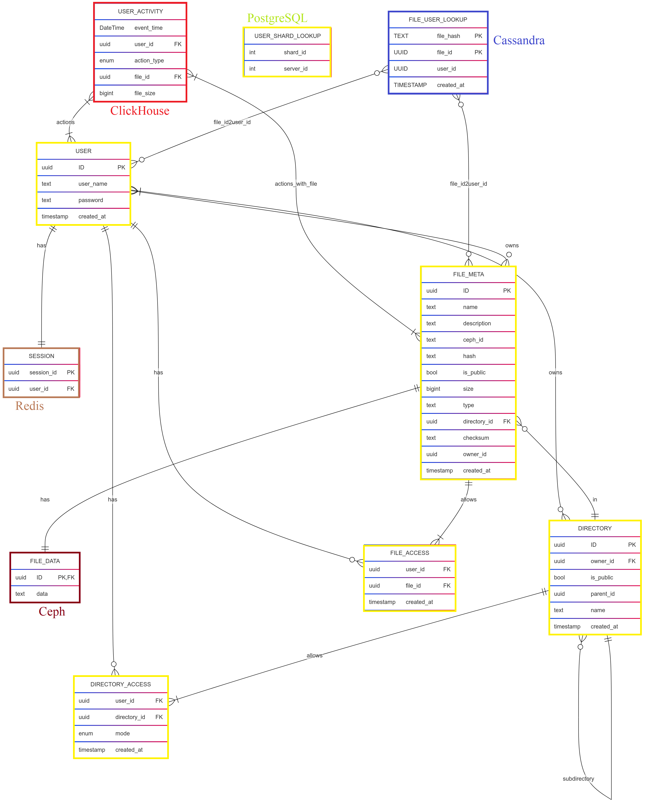

# 1. Тема, MVP, анализ аудитории.
**Облако Mail.ru** - облачный сервис для хранения и обмена файлами.

### MVP
1. Загрузка файлов на облако;
2. Скачивание файлов с облака;
3. Возможность создания директорий для распределения по ним файлов;
4. Отображение файлов и директорий списокм (листинг);
5. Отображение метаинформации о файле (название, формат, вес, дата добавления);
6. Возможность предоставить доступ к хранилищу или к папке другому человеку;

### Анализ трафика
- MAU - 23 млн.[^1]
- DAU - 2.5 млн.[^1]. Примем во внимание, что речь в заявлении идет о пользователях ресурса без учета пользователей мобильного приложения.
- За год пользователи загружают 30 млрд. файлов[^2]
- Общий объем хранилища составляет 600 петабайт[^2]

### Анализ аудитории
По данным сайта Similarweb[^3] аудитория распределяется следующим образом:

Таким образом, можно сказать, что вся ключевая аудитория располагается на территории СНГ.

# 2. Расчет нагрузки
## Продуктовые метрики
- **Средний размер хранилища мользователя** - так как компания не разглашает информацию о среднем хранилище пользователя, я провел опрос с участием 100 человек и установил, что средний размер облачного хранилища пользователя составляет 37 Гб.
- **DAU** - 2.5 млн. Как уже было сказано ранее, это пользователи ресурса без учета мобильного приложения. Основываясь на том, что основная доля пользователей Облака Mail.ru из России и того, что доля мобильного трафика в России составляет 45,3%[^6], то примем DAU равным 4.6 млн, полагая, что все пользователи мобильных устройств используют мобильное приложения.
- **Среднее количество действий пользователя** - т.к. за год пользователи загружают 29.3 млрд. файлов[^5], то это в среднем 80 млн. файлов в день. Исходя из дневной аудитории в 4.6 млн. пользователей можно предположить, что в день средний пользователь загружает 17 файлов. Такой большое значение связано, скорее всего, с тем, что у мобильного и десктопного приложение есть возможность автоматически загружать на облако данные из галереи на телефоне, либо же из выбранной папки на компьютере. Ввиду того, что мы разрабатываем MVP - опустим функцию синхронизации облачного хранилища с хранилищем на телефоне или ПК. Тогда, примем число ручных загрузок файлов равным 3, а число скачиваний равным 6.

Найти информацию о среднем весе одного файла не удалось, поэтому, основываясь на том, что в основном пользователи хранят на облаке изображения со средним весом 1.75 Мб, чуть реже PDF со средним весом 1.5 Мб и еще реже mp4 со средним весом 300 Мб[^5] проведем расчеты. В пятерке самых распространенных файлов первые 3 места занимают изображения в разных форматах, 4 место PDF и 5 место MP4. На основе этих данных предположим, что 50% файлов, хранимых пользователями - фото, 30% - документы, 15% - видео, и 5% - прочие файлы весом 0-20 МБ. Тогда средний размер одного файла 0.5 * 1.75 Мб + 0.3 * 1.5 Мб + 0.15 * 300Мб + 0.05 * 10Мб = 47 Мб.

Предположим, что средний пользователь просматривает информацию о каждом файле до скачивания. Также пусть пользователь 3 раза в день заправшивает список файлов и этот список будет содержать максимум 20 файлов.

Итого:
Параметр | Значение
------ | ------
Месячная аудитория | 23 млн. человек
Дневная аудитория | 4.6 млн. человек
Средний размер хранилища пользователя | 37 Гб
Средний размер одного файла | 47 Мб
Загрузка файлов | 3 файлов/день
Скачивание файлов | 6 файлов/день
Листинг | 3 запроса по 20 файлов в день
Метаинформация о файле | 6 запросов/день
Метаданные пользователя | 78 байт
Метаданные файла | 119 байт

## Технические метрики
### Размер хранения
Компания утверждает, что размер хранилища составляет 600 Пб[^2].
### Сетевой трафик
Посчитаем сетевой трафик при загрузке файла на облако и скачивании файла с облака. Также нам нужно
- **Загрузка файлов на облако** - 3 запроса/день * (47 Мб) = 141 Мб/день;
- **Скачивание файлов с облака** - 282 Мб/день;

Тогда средний суточный трафик загрузки будет равен: 4.6 млн. * (3 запроса/день / 86400) * (47 Мб) * 8 / 1024 = 58 Гбит/с. Для скачивания трафик будет, соответственно, равен 116 Гбит/с. Всего за сутки трафик загрузки будет составлять: 4.6 млн * 3 запроса/день * (47 Мб) / 1024 = 633400 Гб/сутки. Суточный трафик скачивания - 1266800 Гб/сутки.

При запросе списка из 20 файлов мы запрашиваем только название (text весом 31 байт) и формат (text весом 7 байт). Получаем, что за день 4.6млн * (3 запроса/день /86400) * (38 байт) * 8 = 47,42 Кбит/с. За сутки 4.6 млн * 3 запроса/день * (38 байт) = 500 Мб/сутки.
При запросе метаинформации о файле мы запрашиваем его название (31 байт), его формат (7 байт), его размер (8 байт) и дату создания (8 байт). Итого 54 байта. Пиковый показатель 4.6млн * (6 запросов/день / 86400) * (54 байта) * 8 = 135 Кбит/с. За сутки 4.6млн * 6 * 54 байта = 1,4 ГБ/сутки.

Для дальнейших расчетов примем, что в пиковые часы мы будем ограничивать трафик, так как скорость передачи информации не играет существенной роли в контексте облачных сервисов. 
Так как каналы дуплексные, то итоговые значения не нужно скалдывать, так как загрузка и скачивание происходят параллельно.

Тип трафика | Пиковое в Гбит/c | Суммарный суточной Гб/cутки
------ | ----- | -----
Загрузка файла | 58 | 633400
Скачивание файла | 116 | 1266800
Листинг файлов | 47,42 * 2 ^ (-20)| 0,5
Отображение информации о файле | 135 * 2 ^ (-20) | 1,4
Итого | 116 | 1266801

### RPS
Посчитаем RPS в предположении, что пиковый RPS будет в 2 раза выше среднего.

Запрос | средний RPS | Пиковый RPS 
------ | ------ | -----
Загрузка файла | 4.6 млн * 3 / 86400 = 160 | 320
Скачивание файла | 4.6 млн * 6 / 86400 = 320 | 640
Листинг файлов | 4.6млн * 3 / 86400 = 160 | 320
Отображение информации о файле | 4.6 млн * 6 / 86400 = 320 | 640
Итого | 960 | 1920

## Глобальная балансировка нагрузки
### Функциональное разбиение по доменам
- Основной домен (точка входа): cloud.mail.ru;
- Отдача статики: static-XX.cloud.mail.ru (XX - номер сервера);
- Отдача динамического контента (листинга файлов, метаинформации): api.cloud.mail.ru;
- Загрузка файлов в хранилище: s3-XX.cloud.mail.ru (XX - номер сервера);
### Расположение датацентров
Исходя из данных similarweb основная часть пользователей находится в России[^3]. Значит, для глобальной балансировки нагрузки можно обойтись без DNS-балансировки, так как нам нужна балансировка внутри страны.

Теперь нужно разобраться с расположением датацентров внутри страны. Наибольшее количество пользователей проживает в Москве, Санкт-Петербурге, Уфе, Краснодаре и Новосибирске. Значит, нужно расположить датацентры в этих городах. Стоит принять во внимание, что в этом списке нет ни одного города на Дальнем Востоке. Основываясь на численности населения, установим датацентр в Хабаровске, чтобы у пользователей из Дальнего Востока был датацентр поблизости. Посмотреть насположение серверов можно на карте:

### Функционал датацентров
Основной домен (cloud.mail.ru) и домен для отдачи динамического контента (api.cloud.mail.ru) расположим в датацентре Москве.

CDN для отдачи статики (static-XX.cloud.mail.ru) и S3 хранилища расположим в ДЦ в Москве, Санкт-Петербурге, Уфе, Краснодаре, Новосибирске и Хабаровске.

### Расчет плотности запросов
Сделаем выводы о распределении плотности нагрузки на основании плотности населения:
Учтем не только население городов, но и население субъектов федерации, в которых эти города находятся:
- Москва: 12,6 млн человек.
- Санкт-Петербург: ~5,6 млн человек.
- Республика Башкортостан (субъект федерации, где находится Уфа): ~4,1 млн человек.
- Краснодарский край (субъект федерации, где находится Краснодар): ~5,8 млн человек.
- Новосибирская область (субъект федерации, где находится Новосибирск): ~2,8 млн человек.
- Дальневосточный федеральный округ (ДФО): ~8,1 млн человек.

Тогда получаем следующее распределение трафика:
- Москва: весь трафик API + 32% трафика CDN
- Санкт-Петербург: 14% трафика CDN
- Уфа: 11% трафика CDN
- Краснодар: 15% трафика CDN 
- Новосибирск: 7% трафика CDN
- Хабаровск: 21% трафика CDN

| Тип запроса                    | Москва, RPS | Санкт-Петербург CDN, RPS | Уфа CDN, RPS            | Краснодар CDN, RPS    | Новосибирск CDN, RPS | Хабаровск CDN, RPS |
|--------------------------------|-------------|--------------------------|-------------------------|-----------------------|----------------------|--------------------|
| Загрузка файла                 | 103         | 45                       | 35                      | 48                    | 23                   | 67                 |
| Скачивание файла               | 206         | 90                       | 70                      | 96                    | 46                   | 134                |
| Листинг файлов                 | 320         | 0                        | 0                       | 0                     | 0                    | 0                  |
| Отображение информации о файле | 640         | 0                        | 0                       | 0                     | 0                    | 0                  |
| Итого                          | 1269        | 135                      | 105                     | 144                   | 69                   | 201                |

### Схема балансировки
Для балансировки нагрузки будем использовать технологию BGP Anycast:
- Все датацентры объединяются в одну автономную систему и анонсируют один IP адрес, благодаря чему все запросы с помощью технологии BGP Anycast приходят на ближайший датацентр. 
- Во всех датацентрах установлены CDN сервера и S3 хранилища. Если файл, запрашиваемый пользователем, отсутсвтует на CDN сервере, то совершается запрос к S3 хранилищу, после чего полученный файл кешируется CDN сервером.
- Если один из ДЦ выходит из строя, то весь трафик автоматически перенаправляется в другой ближайший ДЦ. 

## Локальная балансировка нагрузки
Итак, трафик пришел в датацентр после глобальной балансировки нагрузки. Теперь нужно придумать способ добавить балансировку внутри самого датацентра. Разумно будет установить L7-балансировщик, но необходимо сделать систему отказоустойчивой, поэтому добавим к нему L4-балансировку.

## L4-балансировщик
Для L4-балансировки будем использовать Virtual Server via Direct Routing. С его помощью мы будем распределять нагрузку между L7-балансировщиками. Мы можем применить эту технологию, так как работаем внутри одного датацентра и L4 и L7 балансировщики находятся в одной подсети.

Для обеспечения отказоустойчивости необходимо следить за состоянием L7-балансировщиков. Используем сервис Keepalived, который будет делать запросы на L7-балансировщики и проверять их состояние.

## L7-балансировка
Установим внутри каждого датацентра веб-сервер с установленным nginx, который будет выоплнять следующий функции:
- Проксирование запросов к файловому хранилищу;
- Обратное проксирование;
- Терминация SSL;
- Распределение запросов по серверам API;
- Ограничение частоты запросов;
- Поддержание keepalive-соединений;
- Сжатие данных;
- Установка таймаутов;
- Перенаправление идемпотентных запросов с нерабочего сервера на рабочий;

## Управление stateless-сервисами
Для масштабирования stateless-сервисов развернем кластер Kubernetes, в рамках которого Nginx выступает в роли Ingress-контроллера и L7-балансировщика. Kubernetes автоматически управляет масштабированием и обновлением инстансов Nginx, отслеживая состояние подов с помощью readiness и liveness probes. При изменении нагрузки или отказе отдельных компонентов Kubernetes оперативно перезапускает или масштабирует Nginx. Для Service Discovery будем использовать etcd.  

### Терминация SSL
Терминация SSL создаст дополнительную нагрузку на процессор. Примем во внимание, что средний размер SSL-сессии - 1 КБ, а средняя нагрузка современных алгоритмов шифрования на процессор составляет 0,75 мс на одно соединение. Тогда **объем данных = RPS * 1 Кб**, **Необходимые ядра = RPS * 0,75 мс**.

| Датацентр       | RPS    | Объем данных КБ/с | Требуемые ядра CPU |
|-----------------|--------|-------------------|--------------------|
| Москва          | 1269   | 1269              | 1                  |
| Санкт-Петербург | 135    | 135               | 1                  |
| Уфа             | 105    | 105               | 1                  |
| Краснодар       | 144    | 144               | 1                  |
| Новосибирск     | 69     | 69                | 1                  |
| Хабаровск       | 201    | 201               | 1                  |

### Логическая схема БД

Нам также понадобится хранить различные метаданные пользователей и файлов: имя пользователя, ID пользователя, имя файла, путь к нему в файловом хранилище, является ли файл директорией и т.д. Рассмотрим примерную схему БД метаданных:

### Описание схемы БД
Таблица          | Описание
-----------------| ------
USER             | Таблица с информацией о пользователе
SESSION          | Информация о сессиях пользователя
FILE_META        | Таблица, содержащая основную метаинформацию о файле
FILE_DATA        | Сам файл
USER_ACTIVITY    | Данные о действиях пользователя. Поле action_type принимает следующие значения: upload, download, delete, share.
FILE_METRICS     | Данные о файлах для аналитики. Содержит информацию о загрузках и скачиваниях файла, а также о пользователях, взаимодействовавших с файлом
DIRECTORY        | Таблица со списком директорий. У каждой директории есть родительская директория, так что можно создавать директории внутри директорий
FILE_ACCESS      | Таблица содержит информацию о доступе пользователей к файлам, который они могут скачать и метаинформацию о которых они могут просмотреть
DIRECTORY_ACCESS | Таблица содержит информацию о доступе пользователей к директориям и о режиме доступа: запись (w), чтение (r), чтение и запись (rw). При доступе только на запись у пользователя есть возможность добавлять свои файлы в директорию, но нет возможности видеть чужие файлы. При записи на чтение есть возможность видеть и скачивать чужие файлы.

## RPS таблиц в БД
Каждый запрос на скачивание файла будет создавать запрос на чтение к таблицам FILE_ACCESS и DIRECTORY_ACCESS (640 RPS). При каждой загрузке файла мы будем делать запись в таблицы: FILE_META, FILE_ACCESS. Значит к обоим этим таблицам будут приходить 320 RPS на запись. При листинге файлов мы должны проверить права пользователя на директорию, то есть сделать запрос к таблице DIRECTORY_ACCESS, затем сделать запросы из таблиц FILE_META и DIRECTORY и отобразить нужные файлы и директории. Соответственно у нас будет +320 RPS на чтение в эти таблицы. При отображении информации о файле нужно проверить доступ к файлу в FILE_ACCESS и DIRECTORY_ACCESS, после чего получить метаинформацию о файле из таблицы FILE_META. Значит к этим таблицам добавляется 640 RPS на чтение. Так как создание директорий, предоставление пользователям доступа к файлам и директориям, а также запись и чтение таблицы USER не являются частыми операциями, то ограничим их 100 RPS. Каждый запрос на чтение и запись должен проходить авторизацию, поэтому он будет сопровождаться чтением из таблицы SESSION. Запись в таблицу SESSION происходит не часто, поэтому также ограничим 100 RPS. Каждое действие пользователя должно быть записано в USER_ACTIVITY, а каждое скачивание файла в FILE_METRICS. Получается USER_ACTIVITY(запись) = скачивания(RPS) + загрузки(RPS) + поделиться файлом(RPS), FILE_METRICS(запись) = скачивание файла(RPS). Так как FILE_METRICS и USER_ACTIVITY таблицы для аналитики, то чтение из них будет происходить не часто и мы ограничим его 100 RPS. SESSION(чтение) = загрузка + скачивание + листинг + чтение метаинформации + создание директории + чтение файлов в директории + чтение из аналитических таблиц. Взаимодействие с FILE_DATA происходит при загрузках и скачиваниях.
Таблица          | Запись | Чтение
-----------------|--------|--------
USER             | 100    | 100
SESSION          | 100    | 2540
FILE_META        | 320    | 960  
FILE_DATA        | 320    | 640
USER_ACTIVITY    | 1380   | 100
FILE_METRICS     | 960    | 100
DIRECTORY        | 100    | 320
FILE_ACCESS      | 420    | 1280
DIRECTORY_ACCESS | 100    | 1920

### Строки таблиц
Предположим, что у нас зарегистрировано в 2 раза числа ежемесячно активных пользователей. Тогда в таблице USER будет 2 * MAU = 2 * 23 млн. = 46 млн. строк. 

В таблице SESSION мы храним сессии активных пользователей, которые будут протухать раз в месяц. Также предположим, что половина пользователей с предыдущего месяца продолжает пользоваться сервисом, а значит их сессии не удаляются из таблиц. Получаем MAU + 0.5 * MAU = 35 млн.

По заявлениям компании файлы занимают 600 петабайт. Тогда, учитывая, что средний размер файла составляет 47 мб, то всего мы будем хранить (600 * 2^(50)) / (47 * 2^(20)) = 13.7 млрд. файлов. Так как в таблицах FILE_META и FILE_METRICS каждая строка соответствует одному файлу, то в них так же будет 13.7 млрд. строк.

Если в таблице USER_ACTIVITY мы храним информацию о пользовательской активности в течение месяца, то тогда ней будет 1380(RPS на запись) * 60 * 60 * 24 * 30 = 3.58 млрд. строк. 

Учитывая, что создание новых директорий мы ограничили 100 RPS, в то время как создание файлов имеет 320 RPS, то мы можем предположить, что директорий в худшем случае будет в 3 раза меньше, чем файлов. Тогда в таблице будет 4.5 млрд строк.

Так как в таблицу FILE_ACCESS записывают на 1/3 больше, чем в таблицу FILE_META, то мы можем предположить, что в таблице FILE_ACCESS будет на 1/3 больше строк, то есть 17.8 млрд.

В таблице DIRECTORY_ACCESS помимо информации о доступе к каждой директории ее создателя должна быть информация о других пользователях. Предположим, что в этой таблице так же будет на 1/3 строк больше, чем в таблице DIRECTORY.

Таблица          | Число строк  | Занимаемое место
-----------------|--------------|------------------
USER             | 46 млн.      | 3860 Мб
SESSION          | 35 млн.      | 1068 Мб 
FILE_META        | 13.7 млрд.   | 3062 Гб     
USER_ACTIVITY    | 15.58 млрд.  | 750 Гб           
DIRECTORY        | 4.5 млрд.    | 505 Гб
FILE_ACCESS      | 17.8 млрд.   | 663 Гб 
DIRECTORY_ACCESS | 5.85 млрд.   | 235 Гб

## Физическая схема БД
### Запросы
Для начала определим, какие запросы мы будем делать.
1. Проверка доступа пользователя к файлу: SELECT COUNT(*) FROM file_access WHERE user_id = $1 AND file_id = $2;
2. Проверка доступа пользователя к директории: SELECT mode FROM directory_access WHERE user_id = $1 AND directory_id = $2;
3. Вывод метаинформации о файле: SELECT * FROM file_meta WHERE ID = $1;
4. Листинг файлов в директории: SELECT name, 'directory' AS type, NULL AS size, created_at FROM directory WHERE parent_id = $1 UNION SELECT name, type, size, created_at FROM file_meta WHERE directory_id = $1;
5. Поиск по файлам и директориям: SELECTF name, 'directory' AS type, NULL AS size, created_at FROM directory WHERE owner_id = $1 AND name LIKE '%' || $2 || '%' UNION SELECT name, type, size, created_at WHERE owner_id = $1 AND name LIKE $2 || '%';
### Индексы
Основываясь на описанных выше запросах следующие индексы должны ускорить работу
1. CREATE INDEX idx_file_access ON file_access(user_id, file_id); - для поиска пользователей, у которых есть доступ к файлу
2. CREATE INDEX idx_directory_access ON directory_access(user_id, directory_id); - для поиска пользователей, у которых есть доступ к директории 
3. CREATE INDEX idx_search_file ON file_meta(directory_id); - для листинга файлов внутри директории
4. CREATE INDEX idx_directory_search ON directory(parent_id); - для листинга директорий пользователя
5. CREATE INDEX idx_directory_search ON directory(owner_id); - для поиска директорий пользователя
6. CREATE INDEX idx_file_search ON file_meta(owner_id); - для поиска файлов пользователя
7. CREATE INDEX idx_user ON user(username); - для поиска пользователя по имени при аутентификации
8. CREATE INDEX idx_user_activity ON user_activity(event_time, user_id, file_id); - для анализа данных в clickhouse

### Шардирование 
Шардировать будем по ID пользователей. Изначально создадим вирутальные шарды на машинах с разными инстанцами БД. Далее с помощью взятия остатка хэша от ID определим, в какой шард попадет пользователь. Все файлы и директории, загружаемые пользователем также будут попадать в этот виртуальный шард. Далее, при горизонтальном масштабировании базы, мы будем переносить виртаульные шарды на новые серверы, тем самым масштабируя систему, не меняя hash функцию. Для работы с шардированием будем использовать Citus. В соответствии с их рекомендации на один физический шард будет приходиться 50 виртуальных шардов.

Для сопоставления ID пользователя и номера шарда будем использовать lookup таблицу:

Также создадим таблицу в Cassandra для сопоставления file_id и user_id и для поиска файлов по их хешу

### Резервирование
Для данного профиля нагрузок подойдет Master-Slave репликация. У каждого мастера будут по 2 реплики: одна выполняет роль бэкапап и не находится под нагрузкой, в то время как вторая является горячим резервом и дублирует данные на мастере. Так, мы сможем перенести все операции чтения на горячую реплику, тем самым снять часть нагрузки с мастера. Также такая схема позволяет нам снимать бэкапы. 

### S3-хранилище
В качестве S3-хранилища возьмем Ceph. Каждый кластер будет состоять из 8192 групп. По группам файлы будут распределяться с помощью алгоритма Crush, который будет подробнее описан ниже. За каждой группой закрепляется 3 NVMe диска, что позволяет обеспечить отказоустойчивость. Так, если один из дисокв выйдет из строя, то данные не будут потеряны. Если из строя выйдут 2 диска одной группы, то операции с этой группой будут приостановлены до тех пор, пока хотя бы один из дисков не вернется в строй. Чтобы репликации не нагружали оснонвую сеть, то каждый кластер S3-хранилища должен быть оснащен еще и внутрненней сетью, которая соединяет все диски. Это нужно для того, чтобы копирование файла на 2 дополнительных диска не создавало задержку в сети, которая взаимодействует с клиентами. На основе статьи от разработчиков Ceph[^9] можно сделать вывод о том, что это хранилище подойдет под наши нагрузки. Даже несмотря на то, что вряд-ли удастся разогнать хранилище до 1 Тб/с, промежуточные результаты, описанные в статье, удовлетворяют нашим требованиям. В статье[^10] указано, что при работе с 10 миллиардами файлами не наблюдается серьезной деградации производительности.

### Схема БД

## Алгоритмы
### Алгоритм перебалансировки нагрузки
В основе алгоритма перебалансировки нагрузки лежат некоторые особенности Ceph. Разберемся для начала в том, как именно хранятся файлы.

В рамках одного Ceph кластера создается один или несколько пулов. Внутри каждого пула создаются группы размещения (Placement Groups). Пул это логический абстрактный уровень нужный для организации хранения данных пользователя. Группа размещения представляет из себя связующее звено между логическим и физическим уровнями. Каждой группе размещения, по умолчанию, соответствуют 3 диска, один из которых является Primary диском и на него происходит запись данных в первую очередь, а два других нужны для создания реплик этого файла. Копирования файла на диски для реплик происходят по внутренней сети кластера и не влияют на взаимодействие с клиентом. На гифке можно увидеть, как именно происходит выбор Placment группы.

Теперь разберем, что произойдет при добавлении или удалении диска. 
- **Добавление диска.** При добавлении нового диска демоны Ceph находят самые загруженные диски в различных Placement Group и начинают перестраивать карту кластера. В наиболее загруженных группах размещения наиболее загруженный диск меняется на новый. После этого по внутренней сети данные со старого диска начинают перемещаться на новый. Причем Ceph стремится к тому, чтобы все диски в системе были одинаково загружены. Есть возможность кастомизировать процедуру перебалансировки. Так, новым дискам можно поставить изначально вес 0, из-за чего они не будут внедрены в кластер и не вызовут перестройку систему. После этого можно начать плавно увеличивать их вес, чтобы они постепенно внедрялись в различные группы размещения и постепенно забирали себе часть данных и нагрузки. Это позволяет внедрить новые диски в высоконагруженные приложения без влияния на происводительность.
- **Выход диска из строя.** Если диск вышел из строя, то Ceph ждет 5 минут, после чего переходит к процедуре восстановления. Он начинает плавно изменять карту кластера, заменяя вышедший из строя диск в группах размещения на рабочий, после чего используя вторую реплику переносит данные этой группы размещения на новый диск. Если диск возвращается в строй, то Ceph инициализирует процедуру добавления диска, описанную ранее 

### Алгоритм дедупликации контента
Для дедупликации контента будем использовать бэкенд сервер. Файл вначале попадает на бэкенд сервер, где берутся его метаданные, а также вычисляется его хеш. В БД мы также храним хеши всех загруженых файлов. Если такой хеш уже существует, то мы не записываем файл в хранилище, а вместо этого храним ссылку на уже существующий файл в хранилище. Таким образом, если клиент загружает файл, то, вначале файл попадает на бэкенд, где мы считаем его хеш, проверяем, сущесвтует ли файл с таким хешем, и добавляем метаданные в БД. Если файл существует, то записываем в БД вместе с метаданными ссылку на файл и не нагружаем хранилище. Если файл не существует, то загружаем его в хранилище. При скачивании файла запрос клиента попадает на бэкенд сервер, где мы смотрим на Ceph key, после чего возвращаем клиенту подписанный URL, по которому он сможет загрузить файл.

## Технологии
### Генерация подписанных ссылок
Backend сервер при запросе пользователя проверяет его сессию, а также доступ к файлу или директории через запрос к таблицам FILE_ACCESS и DIRECTORY_ACCESS. Если у пользователя есть все доступы, то начинаем генерацию подписанного URL на сервере. Рассмотрим пошаговую генерацию:
1. Составление канонического запроса. Канонический запрос представляет собой строку следующего вида: """GET
/{bucket}/{object_key}
X-Amz-Algorithm=AWS4-HMAC-SHA256&X-Amz-Credential={access_key}%2F{datestamp}%2Fru-central1%2Fs3%2Faws4_request&X-Amz-Date={timestamp}&X-Amz-Expires=3600&X-Amz-SignedHeaders=host
host:{host}

host
UNSIGNED-PAYLOAD""". Эта строка состоит из HTTPVerb, канонический URL, Query параметры, содержащие версию подписи и алгоритм ее вычисления, идентификатор для подписи, время, время, в течение которого действителен URL и заголовки запроса, которые будут подписаны.

2. Составление строки для подписи. "AWS4-HMAC-SHA256" + "\n" +
<timestamp> + "\n" +
<scope> + "\n" +
Hex(Hash-SHA256(<CanonicalRequest>))

3. Формирование подписывающего ключа. Подписывающий ключ  генерируется по следующему алгоритму: DateKey = sign("AWS4" + "SecretKey", "yyyymmdd"). RegionKey = sign(DateKey, "ru-central1"). ServiceKey = sign(RegionKey, "s3"). SigningKey = sign(ServiceKey, "aws4_request")

4. Вычислить подпись с помощью ключа. В ходе этого шага мы применяем сформированный подписывающий ключ к строке для подписи, получая тем самым подпись.

5. Формирование подписанного URL. Для этого все заголовки из канонической строки нужно добавить к URL в качестве Query параметров, дополнив их еще и параметром X-Amz-Signature=<сгенерированная подпись>

Теперь пользователь может скачать объект напрямую из хранилища.

### CRUSH

#### Дерево CRUSH
CRUSH это технология лежащая в основе хранилища Ceph. Для начала он строит дерево кластера, содержащее узлы первого и второго уровня. Узлы первого уровня - группы хранилищ. Это могут быть датацентры, стойки, залы, ряды. На их основе можно задавать правила репликации. Например, реплики должны содержаться на дисках в разных датацентрах или в разных рядах, в разных залах или в разных стойках. Узлы второго уровня - диски.

#### Хеширование
Каждый объект разбивается на чанки по 4 Мб. От каждого чанка считается хеш, который определяет группу размещения и, соответственно, диски, на которые будет размещен объект и его реплики. Хеш как раз позволяет определить путь в дереве до диска. Каждый чанк хранит идентификатор, который указывает на объект, к которому он отсносится, что позволяет собирать файл обратно по чанкам.

#### Репликация
Для CRUSH можно настроить фактор репликации, который определяет, сколько узлов используются для хранения реплик. Можно также настроить минимальное количество записей для работы группы размещения. Например, если у нас фактор репликации 3, а минимальное количество записей 2, то у каждой группы размещения будет по 3 диска, на которых будет храниться запись. При выходе из строя одного диска, группа продолжит свою работу, а CRUSH начнет менять карту калстера, чтобы заменить вышедший из строя диск и перенести на него информацию. Если же из строя выйдет и второй диск одной группы размещения до того, как CRUSH исправит выход из строя первого, то работа группы замораживается до тех пор, пока не найдется хотя бы еще один диск, на котором будут храниться реплики объектов группы.

Как уже было сказано ранее, CRUSH умеет адаптироваться к изменению узлов в кластере. Он, также, способен учитывать загруженность узлов для распределения, которое поддерживает все диски на одном уровне загруженности

| Технология                 | Область применения               | Причины |
|----------------------------|----------------------------------|-----------|
| Go                         | Backend                          | Компилируемый язык с высокой производительностью, многопоточностью, асинхронностью. Подходит для микросервисной архитектуры. Есть много библиотек для выполнения различных задач |
| React                      | Frontend                         | Позволяет быстро разрабатывать масштабируемые надежные пользовательские интерфейсы. Популярность, активное сообщество|
| Typescript                 | Frontend                         | Строгая типизация повышает надежность. |
| Nginx                      | L7 балансировка нагрузки, прокси | SSL терминация, сжатие данных, обратное проксирование и статическое кэширование контента|
| Linux Virtual Server       | L4 балансировка нагрузки         | Работает на сетевом уровне. Выполняет балансировку между L7 балансировщиками, не заглядывая в содержимое пакетов |
| Kubernetes                 | Оркестрация                      | Масштабирование через auto-scaling, service discovery, балансировка внутреннего и внешнего трафика |
| PostgreSQL                 | Основная бд сервиса              | Реляционная бд с поддержкой транзакций, сложных запросов и планировщиком, оптимизирующим запросы |
| Cassandra                  | Основная бд сервиса              | Нереляционная бд с поддржкой высокой нагрузки на чтение и запись, горизонтальное масштабирование |
| ClickHouse                 | Сбор и хранение статистики       | Колоночная бд, оптимизирована для быстрого выполнения аналитических запросов на больших массивах данных с минимальными затратами ресурсов |
| Redis                      | Хранение сессий                  | Подходит для хранения, добавления и удаления сессий, так как все операции выполняются очень быстро. |
| Ceph                       | Хранение файлов                  | S3 хранилище с горизонтальным масштабированием и технологией CRUSH, которая автоматически реагирует на изменение количества дисков и консистентностью данных |
| Prometheus                 | Мониторинг                       | Сбор метрик сервиса |
| Grafana                    | Мониторинг                       | Построение дашбордов по метрикам, аналитика, гибкая настройка |

## Обеспечение надежности
| Компонент системы          | Основной способ резервирования     | Дополнительные технологии     | Комментарий |
|----------------------------|------------------------------------|-------------------------------|-------------|
| LVS (L4)                   | Active-passive (VRRP)              | Keepalived                    | Резервные узлы включаются в работу, когда основной отказывает. Keepalived следит за состоянием серверов, на которые мы балансируем нагрузку |
| Nginx (L7)                 | Active-Passive                     | Kubernetes | При сбое одного инстанса балансировщика трафик автоматически перенаправляется на резервный. Kubernetes автоматически маштабирует и обновляет инстансы Nginx |
| PostgreSQL                 | Репликация (master-slave)          | WAL, PgBouncer            | У каждого мастера есть 2 реплики: одна выполняет роль бэкапап и не находится под нагрузкой, в то время как вторая является горячим резервом и дублирует данные на мастере. Для каждой реплики настроен фейловер |
| Cassandra                  | Репликация (multi-master)          | Репликация c фактором 3 | Данные равномерно распределяются, нет единой точки отказа |
| ClickHouse                 | Репликация (multi-master)          | Distributed tables, S3-бэкапы | Используется для аналитики и хранения пользовательских действий. Репликация и шардирование обеспечивают отказоустойчивость |
| Redis                      | Репликация (master-slave)          | Redis Cluster, кластеризация по user_id | При падении master происходит автоматическое переключение на slave |
| Ceph                       | Распределенная репликация          | Репликация с фактором 3 | Алгоритм Crush обеспечивает хранение файла и 2 его реплик на разных дисках, которые находятся в разных датацентрах |
| CDN                        | Резервирование серверов            | Геораспределение, кэширование, BGP Anycast | Контент доставляется с ближайшего сервера; при сбое используется другой узел |
| Prometheus + Grafana       | Active-active (кластеризация)      | Alertmanager, federation | Кластер метрик, отказоустойчивость за счёт распределённого сбора данных |

## Схема проекта

#### Этап 1 - Балансировка
- **LVS (Linux Virual Server)** - используется для L4 балансировки нагрузки между инстансами Nginx
- **Nginx** - используется для L7 балансировки, кэширования и выступает в качестве обратного прокси.
- **BGP Anycast** - используется для поиска ближайшего CDN сервера.
#### Этап 2 - Обработка запроса
- **Authentification Service** - проверяет сессию пользователя, создает новые сессии и удаляет старые;
- **User Service** - управляет аккаунтами пользователей. Обращается к **Authentification Service** для создания сессии пользователю, который вошел в аккаунт;
- **File Service** - сервис для управления пользовательскими файлами. Состоит из 2х микросервисов: **Authorization**, **Data**;
- **Authorization** - сервис отвечает за авторизацию, т.е. за проверку прав пользователей на доступы к файлам и директориям;
- **Data** - сервис отвечает за сохранение метаданных файла, за генерацию подписанных ссылок, за проверку уникальности файла, за загрузку пользовательских действий в **ClickHouse**, а также за загрузку файла в хранилище. Обращается к **Authorization** для проверки прав пользователя, к **Ceph** для сохранения файла в хранилище.
- **Metrics Service** - сервис по анализу метрик.
- **URL verifier** - микросервис по проврке подписанных URL на подлинность.

## Расчет нагрузки
**Authentification Service**
- RPS = Аутентификация = 960;
- Пиковый RPS = 1920;
- Трафик = 1 Мбит/с;
 
**User Service**
- RPS = Регистрация и аутентификация = 100;
- Пиковый RPS = 200;
- Трафик = 1 Мбит/с;

**Authorization**
- RPS = Загрузка файла + скачивание файла + листинг + отображение информации о файле = 960;
- Пиковый RPS = 1920;
- Трафик = 1 Мбит/с;

**Data**
- RPS = Загрузка файла + скачивание файла + листинг + отображение информации о файле = 960;
- Пиковый RPS = 1920;
- Трафик = 58 Гбит/с;

**Metrics Service**
- RPS = сбор информации о действиях пользователя = DAU * 18 / 86400 = 960 RPS;
- Пиковый RPS = 1920;
- Трафик = 1 Мбит/с;

**URL verifier**
- RPS = скачивание файла = 320;
- Пиковый RPS = 640;
- Трафик = 1 Мбит/с;

| Сервис/компонент | RPS    | Пиковый RPS | Характер сервиса      | CPU   | RAM      | Трафик      |
|------------------|--------|-------------|-----------------------|-------|----------|-------------|
| Authentification | 960    | 1920        | Легкое JSON API       | 1     | 10 Мб    | 1 Мбит/с    |
| Authorization    | 960    | 1920        | Средняя бизнес-логика | 20    | 2000 Мб  | 1 Мбит/с    |
| Data             | 960    | 1920        | Тяжелая бизнес-логика | 192   | 19200 Мб | 58 Гбит/с   |
| Metrics          | 960    | 1920        | Средняя бизнес-логика | 20    | 2000 Мб  | 1 Мбит/с    |
| URL Verifier     | 320    | 640         | Легкое JSON API       | 1     | 10 Мб    | 1 Мбит/с    |
| User             | 100    | 200         | Средняя бизнес логика | 2     | 200 Мб   | 1 Мбит/с    |
| Nginx            | 960    | 1920        | Веб-сервер            | 4     | 40 Мб    | 58 Гбит/с   |
| Итого            | 4260   | 8520        | -                     | 240   | 41.45 Гб | 58 Гбит/с   |

Все сервисы кроме nginx, и URL verifier стоит расположить в один kubernetes. В сумме нужно 240 ядер, 24 ГБ RAM и сетевая карта на 59 Гбит/с. Тогда используем следующую кофигурацию
| Название | Хостинг | Конфигурация                                | Cores | Cnt | Покупка |
| -------- | ------- | ------------------------------------------- | ----- | --- | ------- | 
| kubenode | own     | AMD EPYC 7713P/2x128GB/2xNVMe1T/2x100Gb/s   |    64 |  5  |  €12529 |

Для покрытия необходимости всех сервисов необходимо 4 узла + 1 для резервирования.

### Хранилища
| Хранилище  | Объем    | RPS     | CPU    |
|------------|----------|---------|--------|
| PostgreSQL | 4500 Гб  | 960     | 100    |
| Ceph       | 600 Пб   | 480     | 100    |
| Cassandra  | 1 Тб     | 960     | 100    |
| ClickHouse | 750 ГБ   | 1000    | 50     |
| Redis      | 1068 МБ  | 960     | 10     |

PostgreSQL стоит разбить на 9 шардов для повышения эффективности. Каждый шард будет состоять из 3х узлов: мастера и 2х реплик. Также нужен резервный шард. Кластер Cassandra также стоит разбить на 9 узлов с фактором репликации 3. 

Ceph является сердцем облака, поэтому для конфигурации узлов воспользуемся рекомендациями самих создателей. Получаем следующие сервера:

| Название   | Хостинг            | Конфигурация                                | Cores | Cnt  | Покупка  |
| ---------- | ------------------ | ------------------------------------------- | ----- | ---- | -------- | 
| PostgreSQL | own/bare metal     | 1x5416S/2x64GB/2xNVMe800G/1x10Gb/s          |    16 |  30  |  €4633   |
| Ceph       | own/bare metal     | 2x9454P/12x16GB/10xNVMe15.36T/2x100Gb/s     |    96 |  5   |  €321178 |
| Cassandra  | own/bare metal     | 1x7543P/2x64GB/1xNVMe800G/1x25Gb/s          |    32 |  9   |  €6489   |
| ClickHouse | own/bare metal     | 1x7543P/2x16GB/1xNVMe800G/1x10Gb/s          |    32 |  1   |  €6665   |
| Redis      | own/bare metal     | 1x7453P/2x128GB/2xNVMe1T/2x100Gb/s          |    32 |  1   |  €6033  |

## Список источников
[^1]: [Заявления компании об активных пользователях](https://habr.com/ru/news/711772/)
[^2]: [Объем пользовательских данных в Облаке Mail.ru](https://hi-tech.mail.ru/news/102223-raskryit-obem-polzovatelskih-dannyih-v-oblake-mailru/)
[^3]: [Аналитика трафика cloud.mail.ru](https://www.similarweb.com/website/cloud.mail.ru/#ranking)
[^4]: [Дневная нагрузка почты mail.ru](https://www.cnews.ru/news/line/2023-10-18_pochta_mailru_obrabatyvaet)
[^5]: [Загружаемые файлы облака mail.ru](https://searchengines.guru/ru/news/2058384)
[^6]: [Анализ использования Интернета за 2024 год](https://www.meltwater.com/en/2024-global-digital-trends)
[^7]: [Средний размер файла в облачном хранилище](https://www.globaldots.com/resources/blog/how-much-is-stored-in-the-cloud/)
[^8]: [Интерес к облачных хранилищам в России](https://www.yota.ru/corporate/press/1124222)
[^9]: [Производительность Ceph](https://ceph.io/en/news/blog/2024/ceph-a-journey-to-1tibps/)
[^10]: [Производительность Ceph на больших объемах данных](https://blocksandfiles.com/2020/09/22/ceph-scales-to-10-billion-objects/)
